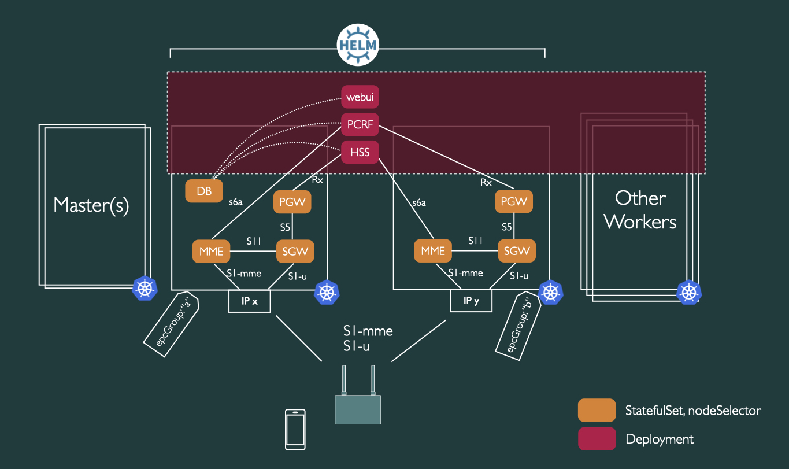

# p5g-helm
Private 5G/LTE Helm Charts
## Description and Purpose
A 5G/LTE core solution for deployment on Kubernetes using Helm using network functions from the wonderful [Open5GS](https://open5gs.org) project. The ambition with the p5g project is to serve as vehicle for experimenting with 5G/LTE for deployment on premises in private settings such as in factories, logistics centers, warehoses, health-care and process industries where a combination of people and machine communication is desired and where using Kubernetes for the workload orchestration is desired - not only for the 5G/LTE aspects but also for other applications supporting the mission of the organization.
## Deployment architecture
It is assumed that radio base stations will be configured to attach to the IP adress of the nodes labeled in `.Values.epcGroups`. On each such node, SCTP at port 36412 and UDP at 2152 will be port-mapped into the MME and SGW pods at that node. The MME, SGW and PGW are deployed as unique StatefulSets (replicas: 1) and Services (clusterIP: none). Each MME and PGW are also associated with unique Diameter ID's. The HSS and PCRF are Deployments using a Service with a cluster IP. Currently the HSS and PCRF are singletons but they should be possible to scale out. The mongo database is currently only deployed on one node - it is envisioned that the DB should be deployed using a standalone Helm chart. The web user interface is deployed as a Deployment with the service using a load balancer IP adress. It is envisioned that the webUI will eventually reside behind Ingress. 

## Configuration
All configuration of the EPC is performed through the [`values.yaml`](charts/p5g/values.yaml) file.
## Deployment dependencies
* A Kubernetes cluster with the SCTP alpha feature flag enabled. The chart has been tested on Kubernetes v1.18.
* S1AP (36412) and GTP-U (2152) ports available on nodes labeled in `.Values.epcGroups`.
* A loadBalancer deployed with the cluster for reaching the webui. The chart has been tested with Metallb.
* A directory path as specified in `.Values.mongodb.directory` created on node with hostname `.Values.mongodb.hostName`.
* Helm v3.2.4
* kubectl configured to access the cluster
## Testing
Currently, the setup as been subject to limited testing using the OAI soft eNB/UE. Stability with the OAI suite has been an issue on the current setup.
For entering the EPC parameters in `values.yaml` and how to enter UE inforamation into the webUI please refer to the documentation in the file as well as [Open5GS](https://open5gs.org).
